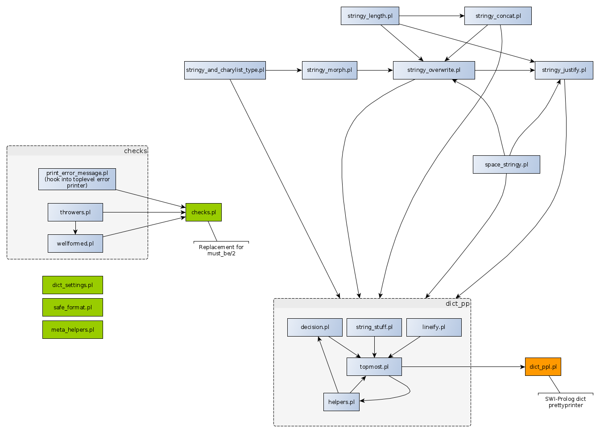

# Some basic predicates that seem useful

## General structure

This directory contains several SWI-Prolog module files (ending in .pl) and their associate unit test files (ending in.plt), which contain
one or more plunit modules.

The module files are relatively "small" and provide specific functionality. We avoid large modules where in-module interrelationships
are hard to survey.

In this picture, the links from `checks.pl` and other commonly used modules (all of which are shown in green)
are elided. Modules in the grey boxes (subdirectories) provide service exclusively to their respective "top" modules.




## Module naming

The name of a module is relatively arbitrary. We always use the atom `onepointfour_basis_X` where `X` is the suffix-less name
of the file in which the module is defined.

## Major elements

### `checks.pl`

A more powerful replacement for the venerable [`must_be/2`](https://eu.swi-prolog.org/pldoc/doc_for?object=must_be/2).
The predicates provided by `checks.pl` are used throughout other code.

[README_checks.md](doc/README_checks.md)  ( The README needs serious overhaul at this point in time )

### `dict_pp.pl`

An SWI-Prolog dict prettyprinter.

[README_dict_pp.md](doc/README_dict_pp.md)

## Minor elements

### `stringy_morph.pl`

A "logical" mapper between atoms and SWI-Prolog strings and "list representations"
of character sequences, i.e. "proper lists of char" and "proper lists of code".
Provides replacement for the predicates
[`atom_string/2`](https://eu.swi-prolog.org/pldoc/doc_for?object=atom_string/2),
[`atom_codes/2`](https://eu.swi-prolog.org/pldoc/doc_for?object=atom_codes/2),
[`string_chars/2`](https://eu.swi-prolog.org/pldoc/doc_for?object=string_chars/2),
[`string_codes/2`](https://eu.swi-prolog.org/pldoc/doc_for?object=string_codes/2).

[README_stringy_morph.md](doc/README_stringy_morph.md)

### `space_stringy.pl`

Create or accept atoms or strings made only of the _SPACE_ character (Unicode code point 0x20).

[README_space_stringy.md](doc/README_space_stringy.md)

### `stringy_and_charylist_type.pl`

Analysis of "stringy" (atom or string) and "chary" (lists of chars or codes) terms.

[README_stringy_and_charylist_type.md](doc/README_stringy_and_charylist_type.md)

### `stringy_concat.pl`

Concantenate several "stringy" terms (atoms or strings) to a single "stringy" term.
A front-end to the corresponding SWI-Prolog predicates.

[README_stringy_concat.md](doc/README_stringy_concat.md)

### `stringy_length.pl`

Determine the length of a "stringy" term (atom or string).

[README_stringy_length.md](doc/README_stringy_length.md)

### `stringy_justify.pl`

Justify text left, right or center in a field of a given width. This is an ingredient of the dict prettyprinter.

[README_stringy_justify.md](doc/README_stringy_justify.md)

### `stringy_overwrite.pl`

Overwrite background text with foreground text. This is an ingredient of the dict prettyprinter.

[README_stringy_overwrite.md](doc/README_stringy_overwrite.md)

### `safe_format.pl`

A simple predicate fronting `format/3`, but able to survive a mistake in the number or type of arguments without throwing.
Strongly useful in any code which may not have been given 100% coverage.

[README_safe_format.md](doc/README_safe_format.md) (README TO BE DONE)

### `meta_helpers.pl`

Various meta-predicate meant to make code writing and especially reading easier.

[README_meta_helpers.md](doc/README_meta_helpers.md) (README TO BE DONE)

### `dict_settings.pl`

A very small set of predicates that are meant to use a dict as an options container, possibly providing defaults for missing options.

[README_dict_settings.md](doc/README_dict_settings.md) (README TO BE DONE)

## Loading a module and running its tests (in SWI-Prolog)

Put the directory just above this package directory
onto the list of library directories. This can be done with the
following directive (or command), where you shall replace `/foo/bar` with
the correct path for your machine:

```
:- assertz(file_search_path(library,'/foo/bar/prolog_code/unpacked')).
```

After that:

- Load the module by relative filename, with [`use_module/1`](https://eu.swi-prolog.org/pldoc/doc_for?object=use_module/1).
- Load the accompanying `.plt` file with [`load_test_files/1`](https://eu.swi-prolog.org/pldoc/doc_for?object=load_test_files/1).
- Run the detected plunit tests with [`run_tests/0`](https://eu.swi-prolog.org/pldoc/doc_for?object=run_tests/0).

For example, for the module defined in file `space_string.pl` (note that SWI-Prolog
loads module files _by filename_ not by module name, although the module name is important):

```
?- use_module(library('onepointfour_basics/space_string.pl')).
?- load_test_files([]).
?- run_tests.
```

The `bin` directory contains a shell script which runs all the test.

## License information

- Author: David Tonhofer (ronerycoder@gluino.name)
- License for the .pl files: [MIT License](https://opensource.org/licenses/MIT)
- License for the .plt files: [Zero-Clause BSD (0BSD)](https://opensource.org/licenses/0BSD)

## Installing the package in SWI-Prolog

According to the [Pack HOWTO](https://eu.swi-prolog.org/howto/Pack.txt):

- Download the pack file, getting the latest from [https://github.com/dtonhofer/prolog_code/packed](https://github.com/dtonhofer/prolog_code/packed).
- On your machine, install the pack file by issuing the Prolog command `pack_install('onepointfour_basics-0.9.tgz')` as described in the [Pack HOWTO](https://eu.swi-prolog.org/howto/Pack.txt).
- This will dump the unpacked contents of the `.tgz` file into `~/.local/share/swi-prolog/pack/onepointfour_basics/` (or the equivalent on your system).

Now you make the module exports visible via:

```
use_module(library('onepointfour_basics/checks.pl')).
use_module(library('onepointfour_basics/dict_pp.pl')).
use_module(library('onepointfour_basics/dict_settings.pl')).
use_module(library('onepointfour_basics/meta_helpers.pl')).
use_module(library('onepointfour_basics/safe_format.pl')).
use_module(library('onepointfour_basics/space_stringy.pl')).
use_module(library('onepointfour_basics/stringy_and_charylist_type.pl')).
use_module(library('onepointfour_basics/stringy_concat.pl')).
use_module(library('onepointfour_basics/stringy_justify.pl')).
use_module(library('onepointfour_basics/stringy_length.pl')).
use_module(library('onepointfour_basics/stringy_morph.pl')).
use_module(library('onepointfour_basics/stringy_overwrite.pl')).
```

Possibly add the above as directives to file `~/.config/swi-prolog/init.pl`

Now you can do some verifications:

```
list_undefined.
load_test_files([]).
run_tests.
```
